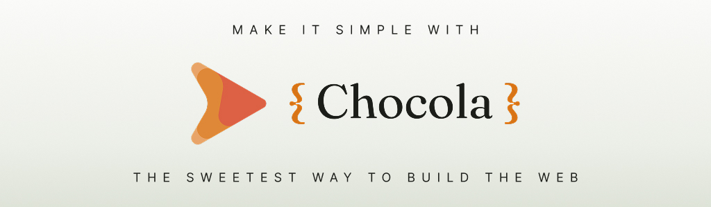

<picture>
    <source media="(prefers-color-scheme: dark)" srcset="assets/banner_dark.jpg">
    
</picture>

## What is Chocola

Chocola is a new and sweeter way to build your web apps.

Just `.html` files with `<template>`, `<script>`, and `<style>` compiled to HTML with scoped CSS the browser already understands, and optional runtime when you need it.

Import components. Instantiate them. Mount, update, remove. Client-side or server-side. Same file, minimal overhead.

```html
<script>
    import CoolButton from './CoolButton.html';

    export let title = "Hello";

    let input;

    function $runtime() {
        input.focus();
    }
</script>

<template>
    <div>
        <h1>{title}</h1>
        <input bind:self="input" type="text" placeholder="Your name">
        <CoolButton label="Not lame button"></CoolButton>
    </div>
</template>

<style>
    h1 { color: chocolate; }
</style>
```

## Supporting Chocola

As of now, Chocola is a project driven by one developer (me, [@sadgabi20](https://github.com/sadgabi20)), but made to be community driven in the future. Therefore, the only current way to support Chocola is via my [GitHub Sponsors](https://github.com/sponsors/sadgabi20).

If this project achieves a wider support, it will have its own official support channels.

## Documentation

- [Getting started](documentation/01-introduction/02-getting-started.md)
- [Project structure](documentation/01-introduction/03-project-structure.md)
- [Build API reference](documentation/07-reference/04-cli.md)

## Roadmap

If you want to know what is being worked on right now, see the [Roadmap](ROADMAP.md).

## Contributing

Please follow the [Contribution Guidelines](CONTRIBUTING.md) to know how to contribute to Chocola.

## License

[MIT](LICENSE)